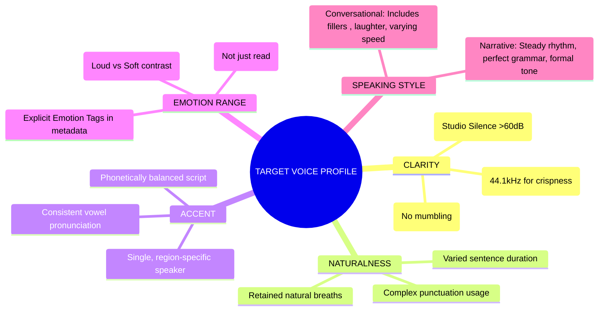

# TTS Dataset Analysis & Pipeline

## 1. Dataset Overview

| Dataset          | Duration | Speakers              | Audio Quality | Best For...                             |
| :--------------- | :------- | :-------------------- | :------------ | :-------------------------------------- |
| **LJ Speech**    | 24 hrs   | 1 (Female, US)        | 22kHz         | Beginners, Single Voice, Benchmarking   |
| **VCTK**         | 44 hrs   | 110 (English accents) | 48kHz         | Accents, Voice Conversion Research      |
| **LibriTTS**     | 585 hrs  | 2,400+ (Various)      | 24kHz         | Voice Cloning, Generalization, "Big AI" |
| **Hi-Fi TTS**    | 292 hrs  | 10 (Studio Pros)      | 44.1kHz       | Commercial Quality, High-Fidelity       |
| **HUI (German)** | 326 hrs  | 5 Major + 117 Minor   | 44.1kHz       | German Language SOTA                    |

## 2. Voice Quality Mapping

_How dataset properties mechanically force output characteristics._

| Attribute        | Input Property                           | Mechanism & Result                                                                                                                                                                                                                             |
| :--------------- | :--------------------------------------- | :--------------------------------------------------------------------------------------------------------------------------------------------------------------------------------------------------------------------------------------------- |
| **Clarity**      | **SNR / Noise Floor**                    | **Mechanism:** Model generates silence too. **Result:** High noise input = "Static/Hiss" in output.                                                                                                                                         |
|                  | **Sample Rate**                          | **Mechanism:** The sample rate defines the highest pitch frequency the model can reproduce (The Nyquist Limit). **Result:** 44.1kHz+ (22kHz limit): "Hi-Fi." Captures the breathiness and subtle mouth clicks that make audio sound "real." |
|                  | **Articulation**                         | **Mechanism:** Alignment/Attention. **Result:** Mumbling input = Glitching/skipping words.                                                                                                                                                  |
| **Naturalness**  | **The "Human-ness" and flow. / Prosody** | **Mechanism:** Pitch variance stats. **Result:** "Audiobook" style = Robotic/hypnotic rhythm.                                                                                                                                               |
|                  | **Breaths**                              | **Mechanism:** Silence trimming. **Result:** No breaths in data = Rushed, breathless output.                                                                                                                                                |
| **Accent**       | **Phoneme Map**                          | **Mechanism:** Vowel shape learning. **Result:** Mixed accents = "Ghost Accent" (unstable vowels).                                                                                                                                          |
| **Pitch/Timbre** | **F0 & Envelope**                        | **Mechanism:** Identity of the speaker / Physical vocal tract shape. **Result:** Cannot change gender effectively without changing timbre.                                                                                                  |
| **Emotion**      | **Data Range**                           | **Mechanism:** Latent space boundaries. **Result:** Neutral input = AI cannot scream or cry.                                                                                                                                                |

## 3. Dataset Selection Guidelines

_Choose based on your specific target use case._

| Dataset              | Gender & Age                | Accent                              | Emotion Range                         | Speaking Style                         | Best For (Target Profile)                                                                                      |
| :------------------- | :-------------------------- | :---------------------------------- | :------------------------------------ | :------------------------------------- | :------------------------------------------------------------------------------------------------------------- |
| **LJ Speech**        | Female Adult (Young)        | US (North American Neutral)         | Low (Consistent, Neutral)             | Read / Formal (Non-fiction Audiobook)  | **AI Assistants** Ideal for standard, pleasant, and clear "Siri-like" voices.                               |
| **LibriTTS** (Clean) | Mixed (M & F, Various Ages) | Mostly US (Some UK/Other)           | Medium (Storytelling dynamic)         | Read / Narrative (Fiction Audiobooks)  | **Narrators** Best for reading long articles or books where natural flow matters more than perfect clarity. |
| **VCTK**             | Mixed (109 speakers)        | Global (Scottish, Indian, US, etc.) | Low (Newspaper reading)               | Read / Neutral (Short sentences)       | **Global/Accent Work** Use when a specific regional accent or voice conversion capability is required.      |
| **Expresso** (New)   | Mixed (2 Male, 2 Female)    | US                                  | High / Stylized (Whisper, Projecting) | Conversational (Filled pauses, laughs) | **Chatbots** The most human-sounding data available for casual, conversational interactions.                |
| **Hi-Fi TTS**        | Mixed (6 Male, 4 Female)    | US / EU                             | Medium (Professional)                 | Read / Studio (High Fidelity)          | **Commercial / Ads** Use when audio quality and crispness are the highest priorities.                       |

## 4. Data Preparation Pipeline

### Phase 1: Preprocessing

- [ ] **Convert:** All files to WAV (16-bit PCM).
- [ ] **Resample:** Target rate (22050 Hz standard, 44100 Hz Hi-Fi).
- [ ] **Channels:** Merge to Mono.
- [ ] **Segment:** Slice to 1–10 seconds (split at pauses).

### Phase 2: Quality Filter

- [ ] **SNR:** >60dB (No background hiss/fans).
- [ ] **Length:** Discard <0.5s (too short) and >10s (too long).
- [ ] **Manual Check:** Listen for clicks, echoes, or breathing artifacts.

### Phase 3: Normalization

- [ ] **Loudness:** Normalize to -23 LUFS or -1.0 dB Peak.
- [ ] **Silence:** Trim start/end silence to exactly 0.1s.
- [ ] **Text:** Expand all non-words (`$5` -> "five dollars", `1990` -> "nineteen ninety").

### Phase 4: Alignment

- [ ] **MFA:** Generate TextGrids to map words to timestamps.
- [ ] **Phonemize:** Convert text to IPA/symbols (e.g., eSpeak-ng).
- [ ] **Validate:** Discard clips where text duration ≠ audio duration.

## 5. Visualizations

### 1. The TTS Dataset Pipeline Diagram

graph TD
%% Define styles
classDef raw fill:#ffcccb,stroke:#333,stroke-width:2px;
classDef process fill:#cce5ff,stroke:#333,stroke-width:2px;
classDef critical fill:#fff4cc,stroke:#fbc02d,stroke-width:2px,stroke-dasharray: 5 5;
classDef final fill:#d4edda,stroke:#28a745,stroke-width:2px;

    subgraph RAW_INPUTS ["RAW INPUTS"]
        A1[Raw Audio Files]:::raw
        A2[Raw Text Transcripts]:::raw
    end

    subgraph AUDIO_PREP ["AUDIO PREP"]
        A1 --> B1(Convert to WAV/Mono)
        B1 --> B2(Resample e.g. 22050Hz)
        B2 --> B3(Silence Trimming & Segmentation)
        B3 --> B4(Loudness Normalization e.g. -23 LUFS):::process
    end

    subgraph TEXT_PREP ["TEXT PREP"]
        A2 --> C1(Text Cleaning)
        C1 --> C2(Normalization e.g. $10 -> ten dollars):::process
    end

    B4 --> D{Alignment Check}:::critical
    C2 --> D

    D -- "Mismatch/Bad Quality" --> E[Discard Error Files]
    D -- "Perfect Match" --> F[Final Formatting e.g. JSON metadata]

    F --> G[(READY TTS DATASET)]:::final

    %% Link styles
    linkStyle 7,8 stroke:#fbc02d,stroke-width:2px;

### 2. Feature Extraction Flow (The Math Conversion)

graph LR
%% Define nodes
subgraph TEXT_PATH ["TEXT PATH (The Input)"]
T1[Normalized Text] --> T2(Phonemization e.g. eSpeak-ng);
T2 -- "h@l'oʊ" --> T3(ID Mapping / Tokenization);
T3 -- "[12, 45, 33, 9]" --> T4(Phoneme Embedding Sequence);
end

    subgraph AUDIO_PATH ["AUDIO PATH (The Ground Truth Target)"]
        A1[Processed WAV] --> A2(STFT / Short-Time Fourier Transform);
        A2 --> A3(Mel-Filterbank);
        A3 -- "Visual Heatmap" --> A4(Mel-Spectrogram);
    end

    %% The convergence point
    T4 --> M(TTS MODEL TRAINER);
    A4 --> M;

    style T4 fill:#d4edda,stroke:#28a745,stroke-width:2px
    style A4 fill:#ffcccb,stroke:#d9534f,stroke-width:2px
    style M fill:#cce5ff,stroke:#007bff,stroke-width:4px

### 3. Voice Characteristic Mapping Diagram (Mindmap)

# End
